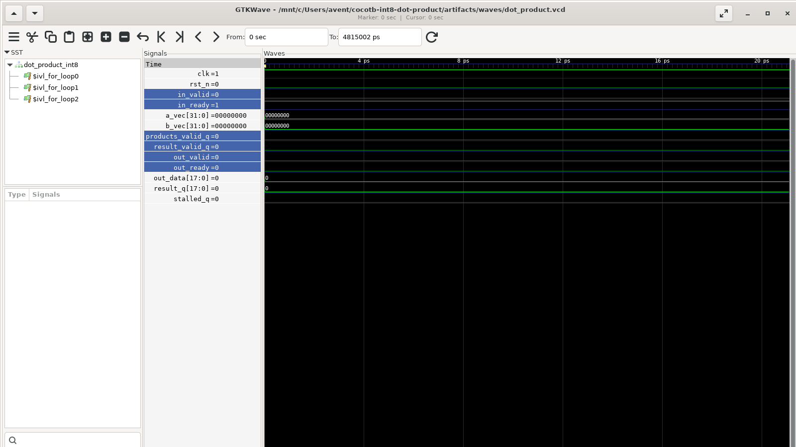

# Cocotb-verified INT8 dot-product accelerator

A compact RTL verification project for a tiny AI accelerator primitive. The
design computes a four-lane signed INT8 dot product with full-precision
accumulation, two pipeline stages, ready/valid flow control, and
one-vector-per-cycle throughput.

```text
 a[4×INT8] ─┐   ┌───────────────┐   ┌────────────┐   result[INT18]
            ├──▶│ 4 multipliers │──▶│ adder + reg│────────────────▶
 b[4×INT8] ─┘   └───────────────┘   └────────────┘
                    stage 1              stage 2
                 ready/valid elastic backpressure
```

## What is verified

- Python golden reference model with explicit two's-complement packing
- Directed signed-arithmetic corners, including `-128 × -128`
- 300 seeded randomized vectors by default
- Random valid gaps and bursty output backpressure
- Ordered scoreboard for loss, duplication, reordering, and data corruption
- Output-stability assertions in both cocotb and SystemVerilog
- Reset flushing and fixed unstalled latency
- Functional coverage exported as readable JSON
- Icarus Verilog and Verilator regressions in GitHub Actions
- VCD generation and a reproducible GTKWave screenshot

The full verification intent is in
[docs/verification-plan.md](docs/verification-plan.md), with coverage bins and
known gaps in [docs/coverage-notes.md](docs/coverage-notes.md).

## Quick start

Prerequisites are Python 3.10+, GNU Make, and either Icarus Verilog or
Verilator.

```bash
python -m venv .venv
source .venv/bin/activate
python -m pip install -r requirements.txt

make unit
make SIM=icarus
make SIM=verilator
```

On Windows, where GNU Make may not be on `PATH`, use the cocotb runner:

```powershell
py -m venv .venv
.\.venv\Scripts\Activate.ps1
python -m pip install -r requirements.txt
python tools\run.py --sim icarus
```

Change the deterministic workload without editing the test:

```bash
RANDOM_SEED=42 NUM_TRANSACTIONS=2000 make SIM=icarus
```

## Waveforms



The screenshot above is captured from the regression-generated VCD, not a
drawn timing diagram. Generate the waveform and open the checked-in layout:

```bash
make SIM=icarus WAVES=1
gtkwave artifacts/waves/dot_product.vcd gtkwave/dot_product.gtkw
```

On Linux, the screenshot itself can be reproduced headlessly with:

```bash
bash tools/capture_waveform.sh
```

The CI run uploads the VCD, functional coverage JSON, and JUnit XML as the
`verification-artifacts` artifact.

## Repository layout

```text
rtl/dot_product_int8.sv       synthesizable two-stage RTL and assertions
tests/reference_model.py      Python golden model and packing helpers
tests/test_dot_product.py     cocotb drivers, scoreboard, checks, coverage
tests/test_reference_model.py unit tests for the model itself
tools/run.py                  cross-platform Icarus/Verilator runner
tools/capture_waveform.sh     reproducible headless GTKWave screenshot
gtkwave/dot_product.gtkw      review-ready waveform layout
docs/                         verification plan, coverage notes, screenshot
.github/workflows/ci.yml      two-simulator regression
```

## Interface

Lane zero occupies the least-significant byte of each packed vector.

| Signal | Direction | Meaning |
|---|---|---|
| `a_vec[31:0]` | input | Four packed signed INT8 operands |
| `b_vec[31:0]` | input | Four packed signed INT8 operands |
| `in_valid/in_ready` | input/output | Input transfer handshake |
| `out_valid/out_ready` | output/input | Result transfer handshake |
| `out_data[17:0]` | output | Full-precision signed result |

The default accumulator width is
`2 × DATA_WIDTH + ceil(log2(LANES)) = 18`, so no saturation or wraparound is
expected for any four-lane INT8 input.
