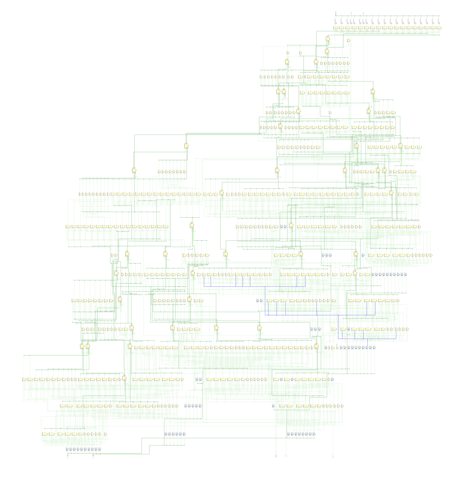
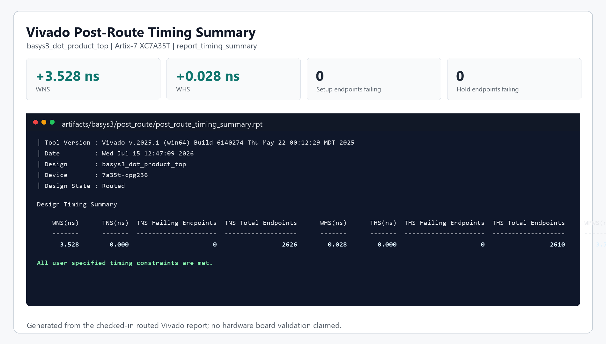
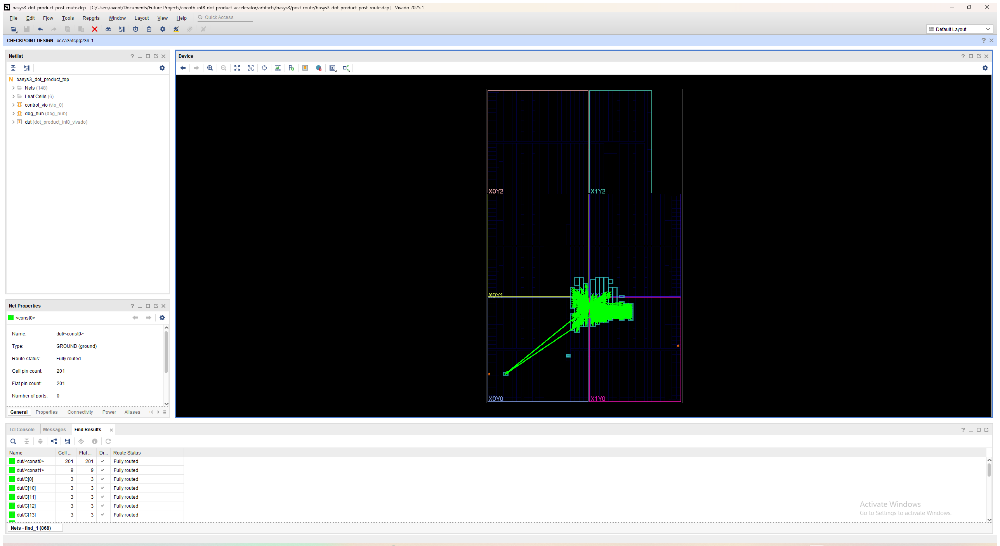

# Basys 3 INT8 Dot-Product Accelerator

A four-lane signed INT8 dot-product accelerator taken past RTL simulation into a routed Vivado implementation for the Digilent Basys 3 and its Artix-7 XC7A35T FPGA.

This repository is organized as portfolio evidence: RTL, self-checking simulation, board-level wrapper work, constraints, Vivado reports, generated bitstream/debug artifacts, and visual proof from the implementation flow.

## Visual implementation evidence

<table>
  <tr>
    <td width="50%">
      
    </td>
    <td width="50%">
      <strong>Clean elaborated architecture</strong><br><br>
      The accelerator unpacks two signed 32-bit operand vectors into four INT8 lanes, computes four signed products, and accumulates them into a full-precision signed 18-bit result through a two-stage ready/valid pipeline.
    </td>
  </tr>
  <tr>
    <td width="50%">
      
    </td>
    <td width="50%">
      <strong>Routed timing summary</strong><br><br>
      Vivado v2025.1 reports the Basys 3 implementation as routed with 100 MHz timing met, +3.528 ns setup slack, +0.028 ns hold slack, and zero failing setup or hold endpoints.
    </td>
  </tr>
  <tr>
    <td width="50%">
      
    </td>
    <td width="50%">
      <strong>Device routing view</strong><br><br>
      The green lines are internal FPGA routing resources connecting placed logic inside the Artix-7 fabric. They are not external board wires.
    </td>
  </tr>
</table>

Optional video evidence: [verified Vivado XSim waveform showcase](docs/media/int8_dot_product_xsim_verified_showcase.mp4).

## Implementation snapshot

| Area | Evidence |
| --- | --- |
| Target board | Digilent Basys 3 |
| FPGA part | Artix-7 `xc7a35tcpg236-1` |
| Main routed top | `basys3_dot_product_top` |
| Accelerator core | `dot_product_int8_vivado` |
| Toolchain | AMD Vivado v2025.1, SW build 6140274 |
| Clock target | 100 MHz on Basys 3 W5 |
| Reset input | Basys 3 centre pushbutton U18 |
| Physical I/O standard | LVCMOS33 |
| Route status | 2041 / 2041 routable nets fully routed, 0 routing errors |
| Timing status | All user-specified timing constraints met |
| Core resources after routing | 296 LUTs, 84 flip-flops, 0 DSP blocks, 0 block RAM |
| Full debug-enabled top after routing | 957 LUTs, 1369 flip-flops, 0 DSP blocks, 0 block RAM |

## Why this project matters

Passing simulation did not make the original design board-ready. The first implementation attempt exposed 88 logical ports directly at the top level. Vivado correctly reported `NSTD-1` and `UCIO-1` because those ports had no package-pin assignments or I/O standards.

Instead of suppressing those checks, the design boundary was rebuilt for the Basys 3:

- Added a board-level wrapper in [rtl/basys3_dot_product_top.v](rtl/basys3_dot_product_top.v).
- Reduced physical board I/O to the 100 MHz clock and centre reset button.
- Moved the wide operand, valid/ready, and result interface into Vivado VIO.
- Added asynchronous reset assertion with two-stage synchronous release.
- Switched the captured Vivado project to the Artix-7 Basys 3 part.
- Added W5/U18 pin assignments, LVCMOS33 standards, 100 MHz clock timing, and reset constraints in [constraints/basys3_dot_product.xdc](constraints/basys3_dot_product.xdc).
- Generated bitstream, debug-probe, routed checkpoint, timing, DRC, route-status, and utilization artifacts under [artifacts/basys3](artifacts/basys3).

## Accelerator behavior

For each accepted transaction, the circuit computes:

```text
result = a[0] * b[0] + a[1] * b[1] + a[2] * b[2] + a[3] * b[3]
```

Each operand vector is packed into 32 bits with four signed two's-complement INT8 lanes. The result is signed 18-bit, which preserves the full precision needed for the sum of four signed 8-by-8 products.

The core ready/valid contract is simple:

- Input data is accepted when `in_valid && in_ready` is true on a rising clock edge.
- Output data is consumed when `out_valid && out_ready` is true on a rising clock edge.
- `out_data` remains stable while `out_valid` is high and `out_ready` is low.
- The two registered stages provide elastic buffering and can sustain one accepted vector per cycle once filled, subject to downstream backpressure.

## Verification

The Vivado testbench is [tb/tb_dot_product_int8_vivado.sv](tb/tb_dot_product_int8_vivado.sv). It uses an ordered scoreboard and checks ready/valid stability during stalls.

The checked-in XSim log reports:

```text
VIVADO RTL PASS: 7 vectors checked; signed INT8 corner = 65536
```

The seven directed expected results are:

```text
70, 65536, -70, -32510, -540, 64516, 0
```

The signed corner case is intentionally included:

```text
4 x (-128 x -128) = 65,536
```

Waveform evidence is available in [artifacts/waves/vivado_xsim.log](artifacts/waves/vivado_xsim.log), [artifacts/waves/vivado_dot_product.wdb](artifacts/waves/vivado_dot_product.wdb), and the [verified waveform video](docs/media/int8_dot_product_xsim_verified_showcase.mp4).

## Vivado evidence map

| Evidence | Path |
| --- | --- |
| Basys 3 constraints | [constraints/basys3_dot_product.xdc](constraints/basys3_dot_product.xdc) |
| Routed timing summary | [artifacts/basys3/post_route/post_route_timing_summary.rpt](artifacts/basys3/post_route/post_route_timing_summary.rpt) |
| Route status | [artifacts/basys3/post_route/post_route_status.rpt](artifacts/basys3/post_route/post_route_status.rpt) |
| Routed utilization | [artifacts/basys3/post_route/post_route_utilization.rpt](artifacts/basys3/post_route/post_route_utilization.rpt) |
| Routed DRC | [artifacts/basys3/post_route/post_route_drc.rpt](artifacts/basys3/post_route/post_route_drc.rpt) |
| Bitstream | [artifacts/basys3/post_route/basys3_dot_product_top.bit](artifacts/basys3/post_route/basys3_dot_product_top.bit) |
| Debug probes | [artifacts/basys3/post_route/basys3_dot_product_top.ltx](artifacts/basys3/post_route/basys3_dot_product_top.ltx) |
| Routed checkpoint | [artifacts/basys3/post_route/basys3_dot_product_post_route.dcp](artifacts/basys3/post_route/basys3_dot_product_post_route.dcp) |
| Original DRC showing 88 unconstrained ports | [artifacts/reports/post_route_drc.rpt](artifacts/reports/post_route_drc.rpt) |

## Reproduce or inspect

Open the captured Vivado project snapshot:

```powershell
vivado vivado/dot_product_int_8.xpr
```

Run the Vivado XSim showcase flow:

```powershell
powershell -ExecutionPolicy Bypass -File vivado\run_showcase.ps1
```

Open the waveform database with the curated signal layout:

```powershell
powershell -ExecutionPolicy Bypass -File vivado\run_showcase.ps1 -OpenGui
```

The portable script [vivado/create_project.tcl](vivado/create_project.tcl) recreates the original core-focused Vivado simulation project. The Basys 3 board implementation evidence is captured in the checked-in Vivado project snapshot and the [artifacts/basys3](artifacts/basys3) reports and handoff files.

## Current hardware status

The implementation has been synthesized, placed, routed, timed, and packaged into bitstream/debug artifacts. The physical Basys 3 board was not available during this stage, so this repository does not claim on-board validation yet.

The next hardware milestone is to program the device, use VIO/ILA to drive and observe one transaction at a time, and repeat the arithmetic, backpressure, pipeline-ordering, and reset-recovery checks in hardware.

## Repository contents

- [rtl/dot_product_int8_vivado.v](rtl/dot_product_int8_vivado.v) - canonical synthesizable accelerator RTL.
- [rtl/basys3_dot_product_top.v](rtl/basys3_dot_product_top.v) - Basys 3 wrapper with VIO-connected control/data paths.
- [tb/tb_dot_product_int8_vivado.sv](tb/tb_dot_product_int8_vivado.sv) - self-checking Vivado XSim testbench.
- [constraints/basys3_dot_product.xdc](constraints/basys3_dot_product.xdc) - board pin, I/O standard, clock, and reset constraints.
- [vivado/dot_product_int_8.xpr](vivado/dot_product_int_8.xpr) - captured Vivado project snapshot.
- [docs/media](docs/media) - employer-facing visual evidence and waveform video.
- [artifacts/basys3](artifacts/basys3) - Basys 3 synthesis, route, timing, DRC, bitstream, probe, and checkpoint artifacts.
