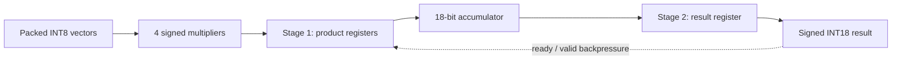
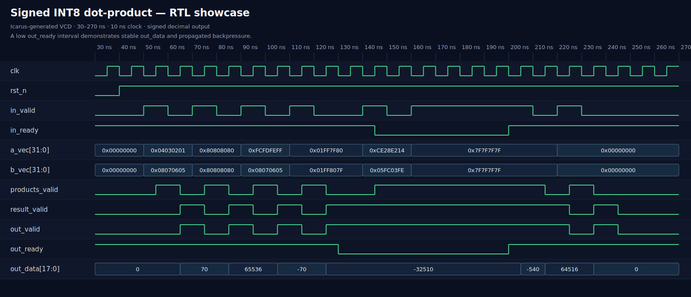

# Signed INT8 dot-product accelerator

[](https://github.com/fortuneolose/cocotb-int8-dot-product-accelerator/actions/workflows/ci.yml)

A two-stage, ready/valid RTL accelerator that computes a four-lane signed INT8
dot product with a full-precision signed result. The repository combines
parameterized SystemVerilog, a conservative Verilog-2001 Vivado translation,
Python and SystemVerilog scoreboards, randomized backpressure testing,
cycle-equivalence checking, reproducible waveforms, and an audited Vivado
post-route implementation.

## Verified project status

| Milestone | Result |
|---|---|
| Python reference-model tests | Pass |
| Cocotb regression | 300 deterministic transactions by default |
| Open-source simulators | Icarus Verilog and Verilator |
| Vivado-compatible RTL smoke test | 7/7 directed vectors pass |
| Original/Vivado RTL equivalence | 1,000 randomized cycles |
| Vivado behavioral simulation | 7/7 vectors pass in XSIM 2025.1.1 |
| Vivado synthesis | Pass |
| Vivado place and route | Pass on `xczu3eg-sfva625-1L-i` |
| 100 MHz post-route timing | Pass: WNS +1.538 ns, WHS +0.077 ns |
| Physical-board bitstream | Not attempted; board pin constraints are required |

The Vivado implementation target is a reproducible evaluation target, not a
claim that the design has been deployed on that physical package.

## Architecture



For four lanes,

```text
y = a[0]b[0] + a[1]b[1] + a[2]b[2] + a[3]b[3]
```

Each operand is signed INT8, each product is signed INT16, and the accumulator
is signed INT18:

```text
ACC_WIDTH = 2 × DATA_WIDTH + ceil(log2(LANES))
          = 2 × 8 + ceil(log2(4))
          = 18 bits
```

The four-lane mathematical result range is −65,024 to +65,536, which fits
without saturation or wraparound in signed INT18. Lane zero occupies the least
significant byte:

```text
a_vec = {a3, a2, a1, a0}
b_vec = {b3, b2, b1, b0}
```

This is why `32'h80808080` represents four separate lanes of −128 rather
than one negative 32-bit operand.

## Interface

| Signal | Direction | Width | Meaning |
|---|---|---:|---|
| `clk` | Input | 1 | Rising-edge clock |
| `rst_n` | Input | 1 | Active-low synchronous reset |
| `in_valid` | Input | 1 | Input vector is available |
| `in_ready` | Output | 1 | Pipeline can accept the vector |
| `a_vec` | Input | 32 | Four packed signed INT8 operands |
| `b_vec` | Input | 32 | Four packed signed INT8 operands |
| `out_valid` | Output | 1 | Result is available |
| `out_ready` | Input | 1 | Downstream can accept the result |
| `out_data` | Output | 18 | Full-precision signed result |

An input transfer occurs on a rising edge when `in_valid && in_ready` is
true. An output transfer occurs when `out_valid && out_ready` is true. With
no stalls, latency is two clock cycles and throughput is one vector per cycle
after the pipeline fills. If `out_ready` is low, the result and
`out_valid` remain stable and backpressure propagates to the input.

## RTL implementations

- `rtl/dot_product_int8.sv` is the parameterized source implementation used
  by cocotb and the primary open-source regressions.
- `rtl/dot_product_int8_vivado.v` is a plain Verilog-2001 translation for
  conservative Vivado ingestion. It fixes the demonstrated configuration at
  four lanes and eight bits while preserving signed arithmetic and protocol
  behavior.
- `vivado/tb_dot_product_equivalence.sv` drives both implementations with the
  same randomized traffic for 1,000 cycles and compares `in_ready`,
  `out_valid`, and every valid result cycle by cycle.

## Verification strategy

The verification environment separates mathematical correctness from
protocol correctness:

1. A pure-Python golden model checks two's-complement interpretation, lane
   packing, and full-precision arithmetic.
2. Directed vectors establish signed boundaries, zero, mixed-sign behavior,
   and the +65,536 corner.
3. Cocotb generates deterministic random operands, valid gaps, and bursty
   `out_ready` stalls.
4. An ordered scoreboard detects loss, duplication, reordering, and data
   corruption.
5. Temporal checks require `out_valid` and `out_data` to remain stable
   during a blocked output.
6. Functional coverage records operand classes, result sign and magnitude,
   backpressure, propagated input stalls, consecutive accepts, and queue
   depth.
7. CI repeats the regression with both Icarus and Verilator and independently
   checks the Vivado translation.

The detailed intent is documented in
[the verification plan](docs/verification-plan.md), and the explicit coverage
bins and remaining gaps are listed in
[the coverage notes](docs/coverage-notes.md).
The latest reproduced simulator results and machine-readable coverage snapshot
are retained under
[`docs/results/verification/`](docs/results/verification/).

### Directed XSIM results

| Vector | `a` lanes | `b` lanes | Expected/observed |
|---:|---|---|---:|
| 0 | `[1, 2, 3, 4]` | `[5, 6, 7, 8]` | 70 |
| 1 | `[-128, -128, -128, -128]` | `[-128, -128, -128, -128]` | 65,536 |
| 2 | `[-1, -2, -3, -4]` | `[5, 6, 7, 8]` | −70 |
| 3 | `[-128, 127, -1, 1]` | `[127, -128, -1, 1]` | −32,510 |
| 4 | `[20, -30, 40, -50]` | `[-2, 3, -4, 5]` | −540 |
| 5 | `[127, 127, 127, 127]` | `[127, 127, 127, 127]` | 64,516 |
| 6 | `[0, 0, 0, 0]` | `[0, 0, 0, 0]` | 0 |

Vivado XSIM reported:

```text
VIVADO RTL PASS: 7 vectors checked; signed INT8 corner = 65536
```

## Reproducible waveform



The image is generated from an actual Icarus VCD produced by
`vivado/tb_dot_product_showcase.sv`; it is not a hand-drawn timing diagram.
The focused window shows the two valid stages, signed output values, and the
interval where `out_ready` is low. CI uploads both the source VCD and the
rendered SVG.

Regenerate it locally:

```bash
make showcase-waveform
```

For interactive inspection, generate the main cocotb VCD and open the checked
in GTKWave layout:

```bash
make SIM=icarus WAVES=1
gtkwave artifacts/waves/dot_product.vcd gtkwave/dot_product.gtkw
```

## Vivado 2025.1.1 implementation

### Target-selection correction

The first synthesis used `xczu3eg-sbva484-1L-i`. Although the logic itself
fit easily, the flattened top level required 88 package pins while SBVA484
provides only 82, producing 107.32% bonded-I/O utilization.

The project was resynthesized for `xczu3eg-sfva625-1L-i`, preserving the
XCZU3EG device, `-1L` speed grade, and industrial temperature grade while
providing 180 package I/O sites. The design then used 88/180 sites (48.89%)
and completed routing.

### Post-route utilization

| Resource | Used | Available | Utilization |
|---|---:|---:|---:|
| CLB LUTs | 298 | 70,560 | 0.42% |
| Flip-flops | 84 | 141,120 | 0.06% |
| CARRY8 | 41 | 8,820 | 0.46% |
| DSP48E2 | 0 | 360 | 0.00% |
| Block RAM tiles | 0 | 216 | 0.00% |
| Bonded I/O | 88 | 180 | 48.89% |
| BUFGCE | 1 | 88 | 1.14% |

The 84 registers correspond structurally to four 16-bit product registers,
one 18-bit result register, and two valid-state registers. Vivado mapped the
four small multipliers into LUT and carry logic rather than DSP48E2 blocks.
That mapping is valid; forcing DSP inference is a useful future
area/performance comparison.

### Post-route timing at 100 MHz

| Check | Result | Status |
|---|---:|---|
| Clock period | 10.000 ns | 100 MHz |
| Worst setup slack (WNS) | +1.538 ns | Pass |
| Total setup violation (TNS) | 0.000 ns | Pass |
| Worst hold slack (WHS) | +0.077 ns | Pass |
| Total hold violation (THS) | 0.000 ns | Pass |
| Worst pulse-width slack | +4.725 ns | Pass |
| Failing setup/hold endpoints | 0 / 0 | Pass |
| Unconstrained internal endpoints | 0 | Pass |

The worst setup path is the combinational handshake path from `out_ready`
to `in_ready`, not the multiplier datapath. Its 4.426 ns data delay is
64.3% routing. The worst hold path runs from `product1_q[14]` to
`result_q[14]` through LUT2/CARRY8 logic and passes with a narrow +0.077 ns
margin.

The audited raw reports are versioned under
[`docs/results/vivado/`](docs/results/vivado/):

- [Post-route timing summary](docs/results/vivado/post_route_timing_summary.rpt)
- [Post-route utilization](docs/results/vivado/post_route_utilization.rpt)
- [Post-route DRC](docs/results/vivado/post_route_drc.rpt)

### DRC and hardware limitation

The routed design has two expected critical warnings:

- `NSTD-1`: all 88 logical ports use the default I/O standard.
- `UCIO-1`: all 88 logical ports have no board-specific pin location.

These warnings intentionally remain unresolved and will block bitstream
generation. They must not be downgraded. A real board deployment requires the
exact board part, valid `PACKAGE_PIN` and `IOSTANDARD` properties, a
board-correct clock pin, and interface timing derived from the connected
hardware.

The timing XDC currently uses a reproducible 2 ns external I/O budget with
equal minimum and maximum values. This is sufficient for an implementation
demonstration, but it is not board-level timing sign-off. Changing pins,
I/O standards, or external min/max delays can change the result—especially the
narrow hold margin—and requires a new implementation run.

## Quick start

Prerequisites:

- Python 3.10+
- GNU Make
- Icarus Verilog or Verilator
- Python packages from `requirements.txt`

```bash
python -m venv .venv
source .venv/bin/activate
python -m pip install -r requirements.txt

make unit
make SIM=icarus
make SIM=verilator
make vivado-rtl-smoke
make vivado-equivalence
make showcase-waveform
```

Override the deterministic workload without editing the test:

```bash
RANDOM_SEED=42 NUM_TRANSACTIONS=2000 make SIM=icarus
```

On Windows without GNU Make:

```powershell
py -m venv .venv
.\.venv\Scripts\Activate.ps1
python -m pip install -r requirements.txt
python tools\run.py --sim icarus --waves
```

## Recreate the Vivado project

Open a Vivado-enabled PowerShell terminal from the repository root.

Behavioral simulation:

```powershell
.\vivado\run_project.ps1 -Action Simulate
```

Create the GUI project:

```powershell
.\vivado\run_project.ps1 -Action Create -Part xczu3eg-sfva625-1L-i
vivado.bat .\vivado\build\int8_dot_product_vivado.xpr
```

Synthesize:

```powershell
.\vivado\run_project.ps1 -Action Synthesize -Part xczu3eg-sfva625-1L-i
```

Synthesize, place, route, and regenerate all final reports:

```powershell
.\vivado\run_project.ps1 -Action Implement -Part xczu3eg-sfva625-1L-i
```

Generated Vivado state is written under `vivado/build/`, and regenerated
reports/checkpoints are written under `vivado/reports/`. Both directories
are ignored because they are reproducible. The audited text reports used for
the results above are retained under `docs/results/vivado/`.

## Repository layout

```text
rtl/
  dot_product_int8.sv              parameterized SystemVerilog RTL
  dot_product_int8_vivado.v        fixed Verilog-2001 Vivado translation
tests/
  reference_model.py               signed golden model and packing helpers
  test_dot_product.py              cocotb drivers, scoreboard, and coverage
  test_reference_model.py          arithmetic-model unit tests
  test_waveform_renderer.py        VCD parser/formatter unit tests
tools/
  run.py                           cross-platform cocotb runner
  render_waveform.py               deterministic VCD-to-SVG renderer
vivado/
  create_project.tcl               reproducible Vivado project creation
  run_project_simulation.tcl       project-mode XSIM regression
  run_synthesis.tcl                synthesis and post-synthesis reports
  run_implementation.tcl           synthesis, place, route, DRC, timing
  tb_dot_product_int8_vivado.sv    seven-vector self-checking testbench
  tb_dot_product_equivalence.sv    randomized cycle-equivalence test
  constraints/                     board-independent 100 MHz timing XDC
docs/
  verification-plan.md             requirements-to-check mapping
  coverage-notes.md                coverage model and known gaps
  showcase-waveform.svg            reproducibly generated RTL waveform
  results/vivado/                  audited routed-design reports
.github/workflows/ci.yml           two-simulator regression and artifacts
```

## Known gaps and next engineering steps

- Select a physical development board and replace the generic top-level I/O
  with board-appropriate pin and electrical constraints.
- Consider an AXI-Stream or register/BRAM wrapper instead of exposing 88
  package pins.
- Compare LUT-based multiplication with explicit DSP48E2 inference.
- Add parameter sweeps for lane count and operand width.
- Add formal ready/valid properties and structural code/toggle coverage.
- Rerun post-route timing after every physical constraint or interface change.

## License

This project is released under the terms in [LICENSE](LICENSE).
